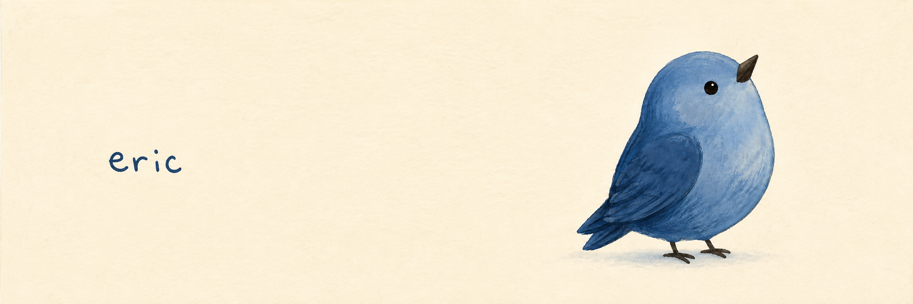

I'm **Eric**, a Marketing and Information Systems student at HKUST, working on **MELI**. I work on language-learning tools and make software for the everyday things I keep thinking about.

I grew up in China, now study in Hong Kong, and work across Korean, English, and Mandarin. Away from a screen, you'll find me singing or playing acoustic guitar with my band.

[LinkedIn](https://www.linkedin.com/in/ericmos/) &nbsp; / &nbsp; [Project notes](work/README.md) &nbsp; / &nbsp; [XiYouQuest source](https://github.com/baduru11/XiYouQuest-RPG-study-web) &nbsp; / &nbsp; [MELI on GitHub](https://github.com/Meliedu)

## Learning a language

**[XiYouQuest](https://github.com/baduru11/XiYouQuest-RPG-study-web)** puts Putonghua practice inside a Journey to the West-inspired adventure, with AI-assisted feedback. My work spans the learning flow, interface, backend, and QA. The link leads to the main collaborative project repository.

**[MELI](https://github.com/Meliedu)** takes that interest into classroom software. Since March 2026, I've been working with HKUST's Center for Language Education on learning workflows, assessment materials, data analysis, and university SSO integration. [Read the project notes](work/README.md#meli).

XiYouQuest has a public development repository. MELI is in development; its GitHub organization is public and its implementation repository is private.

## Making room

**[Yeoback](https://github.com/EricEremos/Yeoback)** is my native macOS storage project. It starts with a simple concern: before removing a file, I want to understand what it is and whether I can recover it. The app brings together storage review, cleanup through Trash, and local growth insight.

Designed and developed by me. Public source and design documentation; the app remains a development preview.

## Remembering a place

**[KOWLO](https://github.com/EricEremos/kowlo)**, previously Hong Kong Footprints, is a personal photo atlas: places, photographs, and notes kept together on a map of Hong Kong. The public project brings together product design and working foundations; the complete experience is still in development.

## The part I care about

**Stay curious. Make things with care. Leave room to grow.**

I like staying with a problem beyond the first idea: testing a workflow, fixing an awkward interaction, and making a decision easier to understand. Research, design, implementation, and checking the result are all part of my work. I use AI throughout that process and take responsibility for what I ship.

If you're working on learning tools, everyday software, or a project that needs both analysis and hands-on making, **[I'd like to hear about it](https://www.linkedin.com/in/ericmos/)**.
